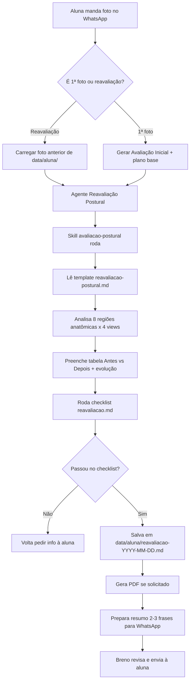

# Workflow — Reavaliação Postural Mensal

Fluxo end-to-end: da foto no WhatsApp até o relatório entregue.

## Passos em detalhe

### 1. Ingestão
- Breno (ou automação futura) salva as fotos em `data/<aluna>/fotos/YYYY-MM-DD/`
- Nomenclatura: `frontal.jpg`, `posterior.jpg`, `lateral-d.jpg`, `lateral-e.jpg`

### 2. Classificação do caso
- Existe `data/<aluna>/reavaliacao-*.md` anterior? → **reavaliação comparativa**
- Não existe? → **avaliação inicial** (relatório simplificado + primeiro plano)

### 3. Execução do agente
- Abre `agents/reavaliacao-postural.md` como prompt base
- Carrega: anamnese da aluna + fotos (atual + anterior) + `core/*`
- Aciona `skills/avaliacao-postural/SKILL.md`

### 4. Gate de qualidade
- `checklists/reavaliacao.md` é checklist HARD — qualquer item falho = não entrega

### 5. Persistência
- Arquivo final em `data/<aluna>/reavaliacao-YYYY-MM-DD.md`
- PDF em `data/<aluna>/reavaliacao-YYYY-MM-DD.pdf`
- Log técnico (o que mudou por região, evolução) em `data/<aluna>/logs/reavaliacao-YYYY-MM-DD.yaml`

### 6. Entrega
- Breno recebe preview + mensagem de WhatsApp pronta
- Breno valida e dispara para a aluna

## Handoff para o agente de dieta

Após a reavaliação, a **fase atualizada** da aluna é input direto para o agente de dieta na próxima atualização mensal. O agente de dieta SEMPRE lê a reavaliação mais recente antes de montar.
